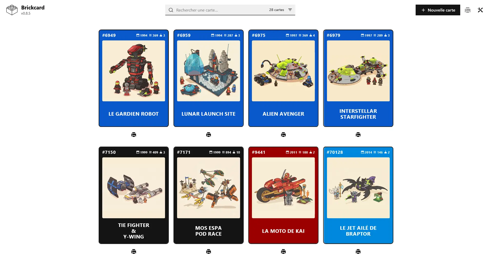
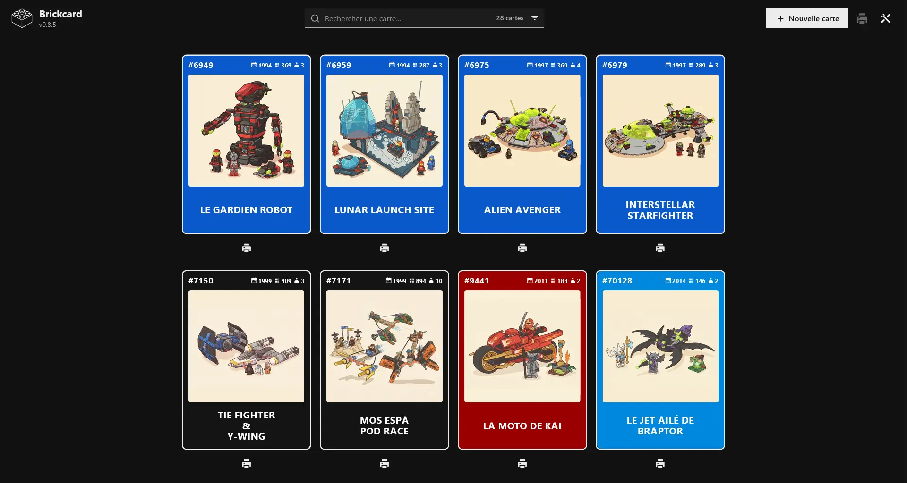
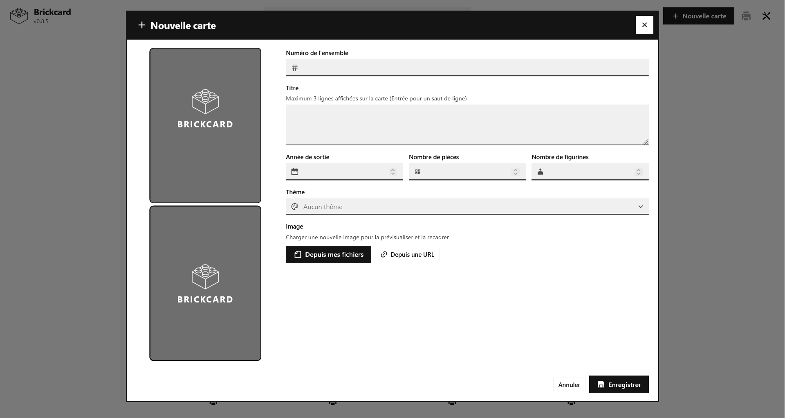
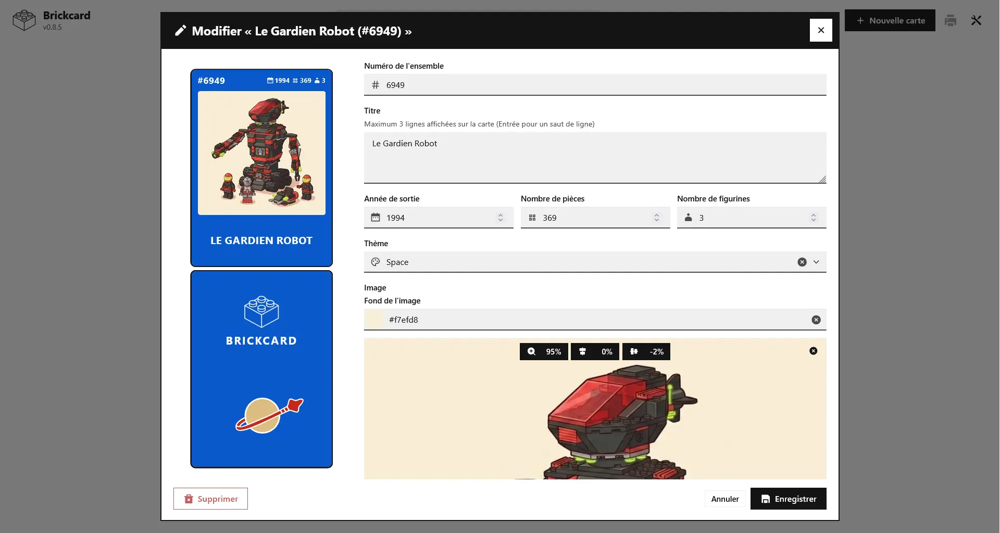
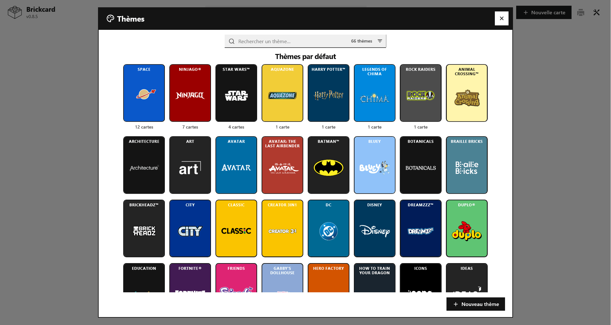
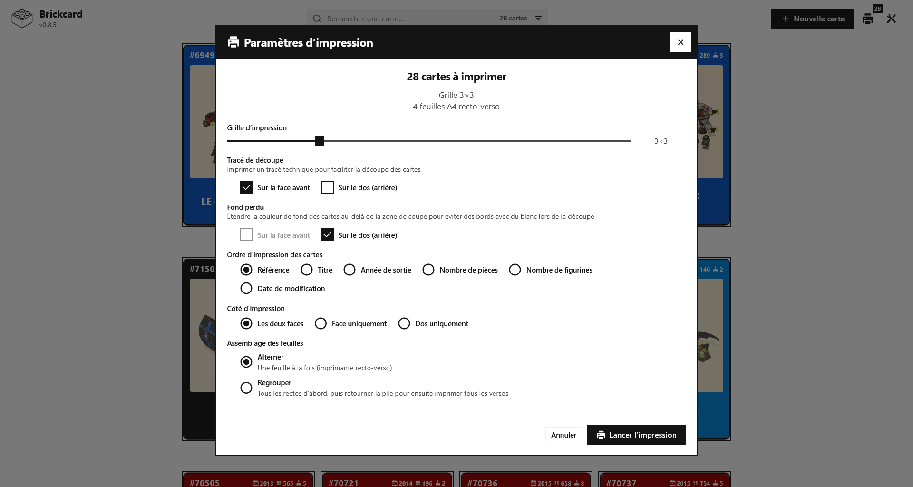

# Brickcard

<picture>
    <source media="(prefers-color-scheme: dark)" srcset="src/img/brickcard-logo-white.svg">
    <source media="(prefers-color-scheme: light)" srcset="src/img/brickcard-logo.svg">
    
</picture>

[](README.fr.md) [](https://github.com/jo-m1b/brickcard/blob/main/LICENSE) [](https://brickcard.org)

> LEGO® is a trademark of the LEGO Group. This is a personal project that is not affiliated with or sponsored by the LEGO Group.

Brickcard is a tiny app for creating and printing playing-card sized cards that describe LEGO® sets (reference, photo, title, theme, year, and piece count).

Create cards, print them, laminate them, and slip them into a clear sleeve with a set whose box has gone missing. My kids love them — and it helps avoid unpacking the wrong set by mistake :P

[](screenshots/brickcard-screenshot-cards.webp) [](screenshots/brickcard-screenshot-cards-dark-mode.webp) [](screenshots/brickcard-screenshot-cards-creation.webp) [](screenshots/brickcard-screenshot-cards-editor.webp) [](screenshots/brickcard-screenshot-themes.webp) [](screenshots/brickcard-screenshot-print-dialog-and-settings.webp)

## Features

- **Create & edit cards**: Reference, photo, title, theme, year, piece count…
- **Print-ready**: A4 grids from 1×1 to 10×10, front + back aligned for duplex printing
- **Themes**: Built-in themes (name, logo, color) + your own custom themes
- **Auto-save**: Everything is stored in the browser (IndexedDB)
- **Export / import**: `.brickcard` files (cards + custom themes) to back up and share your collection
- **Searchable list**: Quickly find and select any card to print
- **Installable**: Works as a PWA on phone or desktop

## Getting started

Just use the live version at [brickcard.org](https://brickcard.org), or run a tiny local server (no build step, no Node required - but ES modules need a server):

```bash
cd src
python3 -m http.server 3615
```

Then open http://127.0.0.1:3615/

## Help and discussion

Please search existing issues and discussions before opening a new one. I do my best to reply, but i may not always have time.

### Bug reports and feature requests

Please post them on [GitHub issues](https://github.com/jo-m1b/brickcard/issues).

### Support and general discussion

Please use [GitHub discussions](https://github.com/jo-m1b/brickcard/discussions).

## Credits

- **Brickcard app logo**: Brick outline icon by [Joko Sutrisno](https://www.vecteezy.com/members/108458460840346680378) on [Vecteezy](https://www.vecteezy.com/vector-art/12802525-brick-outline-icon).
- **Some default theme logos**: From [Brickipedia](https://brickipedia.fandom.com/wiki/List_of_themes) and [Logopedia](https://logos.fandom.com/fr/wiki/Logopedia).
- **Open Sans Font**: Designed by [Steve Matteson](https://mattesontypographics.com), maintained by [The Open Sans Project Authors](https://github.com/googlefonts/opensans).
- **Inter Font**: (card text) Designed by [Rasmus Andersson](https://rsms.me) maintained at [github.com/rsms/inter](https://github.com/rsms/inter)

## License

Brickcard is licensed under the MIT License. See the [LICENSE](LICENSE) file for details.
