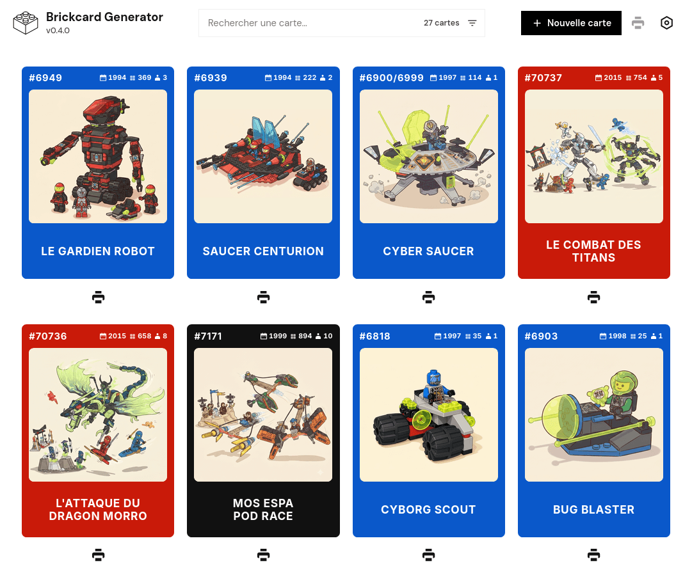

# Brickcard Generator

Mini application web (HTML / CSS / JS) pour créer des **Brickcards** — cartes format carte à jouer décrivant un set LEGO : référence, photo, titre, thème, année, pièces.

Version courante : voir `src/js/version.js` (SemVer) et [`CHANGELOG.md`](CHANGELOG.md).



Usage typique : imprimer, plastifier et glisser dans une pochette transparente avec un set dont la boîte a disparu — pour retrouver facilement le set et ses références (plans).

## Fonctionnalités

- Création / édition de plusieurs cartes (référence, photo, titre, thème, année, pièces…)
- Thèmes LEGO par défaut (nom, logo, couleur) + thèmes personnalisés
- Sauvegarde automatique dans le navigateur (**IndexedDB**, grande capacité)
- Export / import JSON (cartes + thèmes)
- Liste filtrable (recherche)
- Impression A4 optimisée : **9 cartes par feuille**, **face + dos alignés** (recto-verso bord long)

## Lancer en local

Pas besoin d’installer Node ni de compiler. Il faut juste un **petit serveur HTTP** (les modules JavaScript ne marchent pas en ouvrant le fichier directement).

```bash
cd src
python3 -m http.server 8765
```

Puis ouvrir : [http://127.0.0.1:8765/](http://127.0.0.1:8765/)

## Structure du projet

```
├── AGENTS.md
├── README.md
├── CONTRIBUTING.md
├── LICENSE
├── .gitignore
├── .github/workflows/
├── docs/screenshots/              # captures README (versionnées)
└── src/
    ├── index.html
    ├── data/
    │   ├── themes-presets.json
    │   └── page-about.md          # pages Markdown : page-{{slug}}.md
    ├── img/
    ├── css/styles.css
    └── js/
        ├── app.js
        ├── version.js             # SemVer (source unique)
        ├── markdown.js            # parser MD + loadPage
        ├── theme.js
        ├── themes-data.js
        ├── storage.js
        ├── card-render.js
        ├── print.js
        └── views/
```

## Illustration IA (prompt)

Prompt testé pour générer une illustration cartoon à partir d’une photo de set / boîte LEGO (ex. Gemini), à importer ensuite comme image de Brickcard :

```
Generate a cute modern cartoon illustration of LEGO models and minifigures in a dynamic action scene.

The models and characters are arranged dynamically as if in the middle of an action moment: vehicles tilting, flying or speeding, characters in active poses (running, jumping, reacting, interacting), with a clear sense of movement and energy.

Flat 2D cartoon style, clean bold outlines, soft cel-shaded colors, no realistic lighting, no plastic shine, no 3D depth, no volumetric shadows. Soft simple drop shadows only under the models.

Bright cheerful colors, friendly and adorable children’s book illustration look. Soft warm lighting, gentle gradients.

Plain solid pastel background color #fbf1dd, no environment, no extra elements.

Keep every LEGO brick shape, stud, color and detail faithful to the real models — do not invent new bricks.

Centered composition, 16:9 format, energetic and dynamic arrangement, subject compact with a sense of movement.

High quality, clean line art, no text, no logos, no watermarks.
```

## Crédits

- Logo de l’app (`src/img/logo-brickcard-generator.svg`) : icône *brick outline* par [Joko Sutrisno](https://www.vecteezy.com/members/108458460840346680378) via [Vecteezy](https://www.vecteezy.com/vector-art/12802525-brick-outline-icon) (attribution requise).
- Logos de certains thèmes LEGO par défaut (`src/img/logo-theme-*`) : issus de [Brickipedia — List of themes](https://brickipedia.fandom.com/wiki/List_of_themes) (contenu communautaire / Fandom). LEGO® est une marque de The LEGO Group ; ce projet n’est pas affilié ni sponsorisé par The LEGO Group.

Voir aussi [CONTRIBUTING.md](CONTRIBUTING.md).

## Licence

[MIT](LICENSE) — libre d’utilisation, modification et redistribution.
